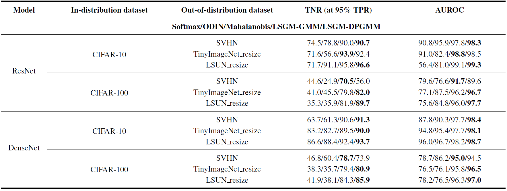

# Joint Distribution across Representation Spaces for Out-of-Distribution Detection

This project is for the paper "Joint Distribution across Representation Spaces for Out-of-Distribution Detection". 

## Preliminaries
It is tested under Ubuntu Linux 16.04 and Python 3.8 environment, and requries Pytorch package to be installed:

* [PyTorch](http://pytorch.org/)
* [scipy](https://github.com/scipy/scipy)
* [scikit-learn](http://scikit-learn.org/stable/)
* [numpy](https://numpy.org/)

## Out-of-Distribtion Datasets
We use two out-of-distributin datasets from [odin-pytorch](https://github.com/facebookresearch/odin):

* [Tiny-ImageNet (resize)](https://www.dropbox.com/s/kp3my3412u5k9rl/Imagenet_resize.tar.gz)
* [LSUN (resize)](https://www.dropbox.com/s/moqh2wh8696c3yl/LSUN_resize.tar.gz)

They are placed to `./data/`.

## Pre-trained Models
We use four pre-trained neural networks from [deep_Mahalanobis_detector](https://github.com/pokaxpoka/deep_Mahalanobis_detector).

* [DenseNet on CIFAR-10](https://www.dropbox.com/s/pnbvr16gnpyr1zg/densenet_cifar10.pth?dl=0) / [DenseNet on CIFAR-100](https://www.dropbox.com/s/7ur9qo81u30od36/densenet_cifar100.pth?dl=0) 
* [ResNet on CIFAR-10](https://www.dropbox.com/s/ynidbn7n7ccadog/resnet_cifar10.pth?dl=0) / [ResNet on CIFAR-100](https://www.dropbox.com/s/yzfzf4bwqe4du6w/resnet_cifar100.pth?dl=0)

They are placed to `./pre_trained/`.

## How to use

```
# model: ResNet, in-distribution: CIFAR-10, batch_size: 200
python OOD_Distance_LSGM.py --dataset cifar10 --net_type resnet --batch_size 200
```

# Experimental Result
This followings are the experimental results, which is the same as in the paper.

 